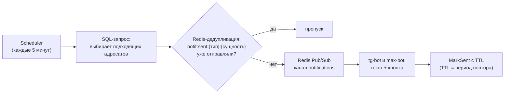
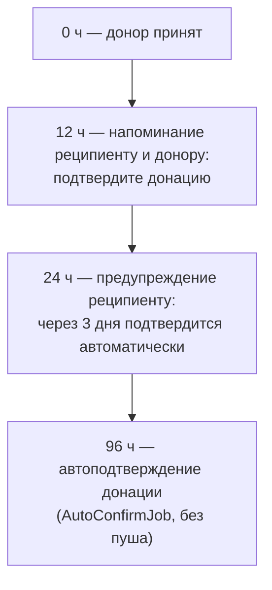

# Реестр уведомлений

Единый источник правды по всем пушам и фоновым задачам. **При добавлении или изменении
уведомления этот документ обновляется в том же PR** — иначе реестр протухнет.

Перед тем как предлагать новое уведомление — посмотрите разделы [Реестр](#реестр-уведомлений)
и [Чек-лист нового уведомления](#чек-лист-нового-уведомления): обычно новое «уведомление»
уже покрыто существующим или отличается от него только текстом.

Документ читается в два слоя:

- **Реестр** — компактные таблицы: когда приходит, как часто, когда перестаёт.
- **[Тексты уведомлений](#тексты-уведомлений-как-видит-пользователь)** — что именно
  пользователь видит в мессенджере, слово в слово. Если нужно понять, «о каком пуше речь»,
  или сверить идею с уже существующим текстом — вам сюда.

## Как работает механизм

- **Первый раз** уведомление приходит, когда выполняется порог из SQL-запроса
  (например, «verified_at старше 24 часов»).
- **Повторы** задаются TTL дедупликации: пока ключ жив — не шлём, истёк — шлём снова.
- **Остановка** — когда адресат перестаёт попадать в SQL-запрос (добавил питомца,
  подтвердил телефон, отклик принят и т.п.). Либо по кнопке («Да»).
- Джоб ходит каждые 5 минут, поэтому фактическое время отправки округляется до 5 минут.

## Реестр уведомлений

Все уведомления доставляются и в Telegram, и в Max (если у пользователя есть
соответствующая identity). Кнопка везде «🩸 Открыть приложение»,
исключение — «Вы ещё ищете помощь?» (кнопки «Да»/«Нет»).

### Сценарий 1: на поиск откликнулся донор, реципиент молчит

Точка отсчёта: `donor_responses.created_at` (момент отклика). Неактивность реципиента
считается от `COALESCE(users.last_seen_at, users.created_at)`.

| Название | Тип (код) | Кому | Первое | Повтор | Остановка |
|---|---|---|---|---|---|
| «Откликнулся донор» | `recipient_donor_waiting` | реципиенту | 30 мин после отклика | каждые 30 мин, пока отклик `pending` | отклик принят/отменён |
| «Донор ждёт принятия» | `donor_not_accepted` | донору | 1 ч после отклика | каждые 72 ч, пока отклик `pending` | отклик принят/отменён |
| «Предупреждение: поиск будет остановлен» | `recipient_inactive_warning` | реципиенту | 6 ч неактивности | каждые 6 ч | пользователь зашёл в приложение или откликов не стало |
| «Поиск закрыт: реципиент не отвечал» | `recipient_search_closed` | реципиенту | 12 ч неактивности | однократно | — (вместе с уведомлением **поиск закрывается**) |

### Сценарий 2: пустая витрина (поиск активен, откликов нет)

Точка отсчёта: неактивность реципиента `COALESCE(users.last_seen_at, users.created_at)`.

| Название | Тип (код) | Кому | Первое | Повтор | Остановка |
|---|---|---|---|---|---|
| «Вы ещё ищете помощь?» (кнопки Да/Нет) | `recipient_empty_showcase` | реципиенту | 24 ч неактивности | однократно | нажата любая кнопка |
| «Поиск закрыт после вопроса» | `recipient_search_closed_inactive` | реципиенту | 48 ч неактивности | однократно | нажата кнопка «Да»; иначе **поиск закрывается** вместе с уведомлением |

### Сценарий 3: донор принят (донор в работе)

Точка отсчёта: `donor_responses.updated_at` (момент перехода в `accepted`).
Условия: отклик `accepted`, `is_confirmed = false`, заявка `active` или `reserved_full`.

| Название | Тип (код) | Кому | Первое | Повтор | Остановка |
|---|---|---|---|---|---|
| «Подтвердите донацию» (12 ч) | `recipient_accepted_reminder_12h` | реципиенту | 12 ч | каждые 12 ч | донация подтверждена |
| «Отметьте донацию» (12 ч) | `donor_accepted_reminder_12h` | донору | 12 ч | каждые 12 ч | донация подтверждена |
| «Последнее предупреждение перед автоподтверждением» (24 ч) | `recipient_accepted_reminder_24h` | реципиенту | 24 ч | каждые 24 ч | донация подтверждена |

Таймлайн сценария целиком (включая автоподтверждение, которое не пуш):

### Сценарий 4: онбординг (регистрация и верификация)

| Название | Тип (код) | Кому | Условие | Первое | Повтор | Остановка |
|---|---|---|---|---|---|---|
| «Завершите авторизацию» | `user_not_verified` | пользователю | телефон не подтверждён | 24 ч после `/start` в боте | каждые 48 ч, **без лимита** | подтвердил телефон |
| «Добавьте питомца» | `user_verified_no_pets` | пользователю | подтверждён, но нет питомцев | 24 ч после верификации | каждые 48 ч, **без лимита** | добавил питомца |

Аудитории не пересекаются: пользователь находится ровно в одной из двух кампаний
(либо не верифицирован, либо верифицирован).

## Тексты уведомлений (как видит пользователь)

Фигурные скобки — подставляемые данные: имя/группа крови питомца, объём крови.
В мессенджере имена питомцев выделяются жирным. Кнопка под сообщением —
«🩸 Открыть приложение», если не указано иное.

### Сценарий 1: на поиск откликнулся донор

**«Откликнулся донор»** (`recipient_donor_waiting`) — реципиенту, через 30 минут
после отклика донора:

> На Ваш запрос откликнулся донор **{имя питомца донора}** (группа {группа крови}).
> Обсудите с хозяином донора донацию, пока он не передумал.

**«Донор ждёт принятия»** (`donor_not_accepted`) — донору, если его отклик не принимают час:

> Вы откликнулись на поиск (**{имя питомца реципиента}**, группа {группа крови},
> {объём} мл), но хозяин реципиента пока не принял Ваше предложение.
> Можете подождать еще немного или отменить донацию и помочь другому питомцу на Портале.

**«Предупреждение: поиск будет остановлен»** (`recipient_inactive_warning`) — реципиенту,
который 6 часов не заходит при живых откликах:

> На Ваш поиск откликнулись доноры, но Вы никого из них не выбрали. Обсудите с хозяином
> подходящего донора детали донации, иначе через 6 часов Ваш поиск будет остановлен,
> чтобы доноры могли помочь другим нуждающимся.

**«Поиск закрыт: реципиент не отвечал»** (`recipient_search_closed`) — реципиенту
после 12 часов молчания; поиск при этом закрывается:

> Вы долго не отвечали донорам, которые хотели Вам помочь, поэтому мы закрыли Вашу заявку.
> При необходимости начните новый поиск для питомца во вкладке «Найти кровь» в приложении.

### Сценарий 2: пустая витрина

**«Вы ещё ищете помощь?»** (`recipient_empty_showcase`) — реципиенту после 24 часов
неактивности, когда на поиске нет откликов. Единственное уведомление с кнопками
«✅ Да» / «❌ Нет» вместо «Открыть приложение»:

> Вас долго не было, Вы еще ищите помощь для питомца **{имя питомца}**
> (группа {группа крови}, {объём} мл)?

Нажатие «Да» продолжает поиск («Хорошо, продолжаем поиск!»), нажатие «Нет»
закрывает поиск сразу. Если ничего не нажимать — через 48 часов поиск закроется сам.

**«Поиск закрыт после вопроса»** (`recipient_search_closed_inactive`) — реципиенту
через 48 часов неактивности, если он не нажал «Да»; поиск закрывается:

> Вас долго не было, поэтому мы закрыли Вашу заявку. При необходимости начните новый
> поиск для питомца во вкладке «Найти кровь» в приложении.

### Сценарий 3: донор принят

**«Подтвердите донацию»** (`recipient_accepted_reminder_12h`) — реципиенту через 12 часов
после принятия донора:

> Вы начали общение с донором **{имя питомца донора}** (группа {группа крови}), но пока
> не подтвердили донацию. Если донация состоялась, подтвердите это на Портале, чтобы донор
> мог получить бонусы за помощь (выберите Ваш поиск - Детали поиска - вкладка Найдено).

**«Отметьте донацию»** (`donor_accepted_reminder_12h`) — принятому донору через 12 часов:

> Вы ранее откликнулись на поиск (**{имя питомца реципиента}**, группа {группа крови},
> {объём} мл). Если донация состоялась, отметьте это на Портале в разделе
> "планируемая донация", чтобы получить бонусы за помощь.

**«Последнее предупреждение перед автоподтверждением»** (`recipient_accepted_reminder_24h`)
— реципиенту через 24 часа после принятия донора:

> Вас долго не было и вы не подтвердили ранее запланированную донацию
> (**{имя питомца реципиента}**, группа {группа крови}). Подтвердите донацию на Портале,
> чтобы донор получил бонусы за помощь. Через 3 дня донация будет подтверждена автоматически.
> Если донация еще не состоялась, можете отказаться и связаться с донором для уточнения деталей.

### Сценарий 4: онбординг

**«Завершите авторизацию»** (`user_not_verified`) — через 24 часа после первого `/start`,
если телефон так и не подтверждён; повторяется каждые 48 часов без лимита:

> Получите полный доступ к Порталу!
> Завершите авторизацию, чтобы быстро найти помощь для питомца или помогать другим.

**«Добавьте питомца»** (`user_verified_no_pets`) — через 24 часа после подтверждения
телефона, если нет ни одного питомца; повторяется каждые 48 часов без лимита:

> Получите полный доступ к Порталу!
>
> Добавьте питомца на Портале, чтобы быстро найти помощь или помогать другим.

## Фоновые задачи без уведомлений

| Задача | Интервал | Что делает |
|---|---|---|
| `AutoConfirmJob` | 10 мин | Автоподтверждает донации: `completed` без подтверждения старше 72 ч; `accepted` старше 96 ч (24 ч на напоминания + 72 ч на решение). |
| `checkRecipientInactive12h` / `checkRecipientEmptyShowcase48h` | в составе джоба уведомлений | Помимо пуша **закрывают поиск** (`CloseRequestHandler`). |

## Чек-лист нового уведомления

Что физически нужно, чтобы появилось новое уведомление (оценка для планирования):

1. **Тип** — константа в `internal/domain/ports/event_publisher.go`.
2. **Момент отсчёта** — время в БД, от которого считаем «через N часов».
   Это **обязательное** условие: если нужного момента в базе нет (например, время
   верификации до 3.29.0), появляется новая колонка + авто-миграция схемы +
   SQL-бэкфилл существующих данных. См. историю с `verified_at`.
3. **SQL-запрос аудитории** — `internal/infra/scheduler/job/notification_queries.go`.
4. **Метод джоба + дедупликация** — `notification_job.go`: ключ `notif:sent:{тип}:{id сущности}`,
   TTL = период повтора.
5. **Тексты в двух ботах** — `tg-bot/src/events/notification/handleNotification.ts`
   и `max-bot/src/events/notification/handleNotification.ts`.
6. **Запись в этот реестр** — и в таблицы, и в раздел текстов.

Ограничения, которые стоит озвучивать до обсуждения новых идей:

- **«За N часов до события» невозможно**, если время события не зафиксировано в БД
  заранее (например, «за 24 ч до плановой донации» требует хранящейся плановой даты).
- Повтор «каждые N часов» реализуется TTL кеша — период должен быть кратен
  интервалу джоба (5 минут) и не обязан совпадать с порогом первого срабатывания.
- Дедупликация живёт в Redis: перезапуск/очистка Redis может привести к повторной
  отправке «уже отправленных» уведомлений.

## Проверка пересечений перед добавлением

1. Совпадает ли **аудитория и состояние** с существующим типом? (например, «донор ждёт
   принятия» уже есть — `donor_not_accepted`.)
2. Не окажется ли новое уведомление **в том же временном окне**, что существующее,
   тому же человеку? (например, в первые 24 ч после `accepted` уже приходят два напоминания.)
3. Есть ли **момент отсчёта** в БД? Если нет — это уже не «добавить уведомление»,
   а «изменить схему данных».
4. Если отличается только текст/время — дешевле поменять существующий тип, чем плодить новый.
